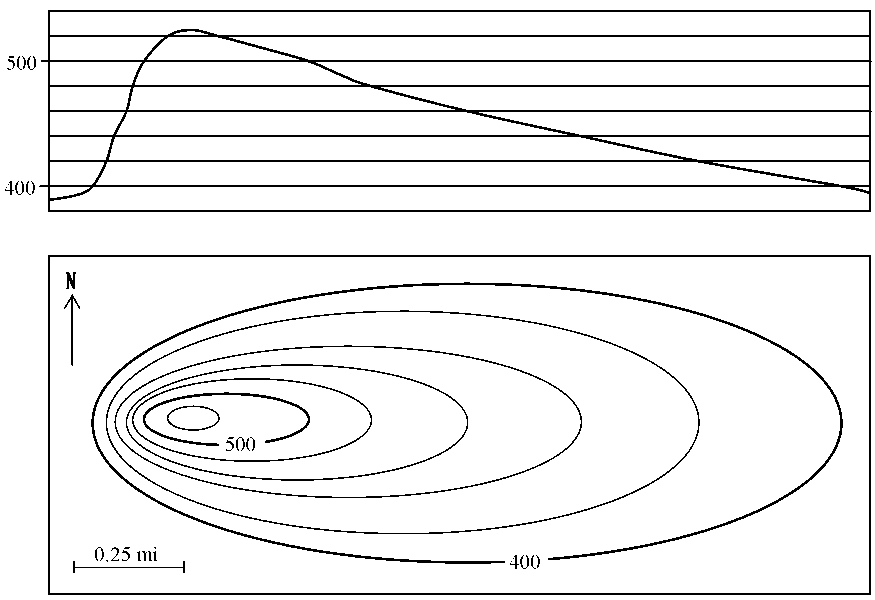
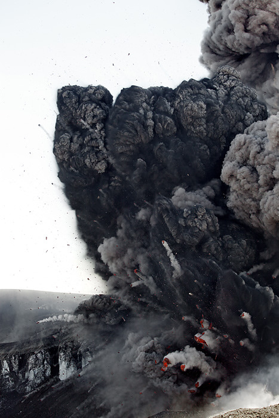

.. _management-describing-your-system:

Documenting
===========

.. epigraph::

  *Now is the time to understand more, so we fear less.*

  -- Marie Curie

This section is a collection of my opinions about how to describe your
distributed system.

Statechart based distributed systems do not stay put.  The smallest change in
the code could wipe out pages and pages of your carefully written documentation.
It might not be worth your time to write everything down.

I'll explore this idea using a topographical map as an analogy.  A topographical
map describes the landscape from a bird's eye view, where each contour line is
drawn at a specific elevation.  To see what this landscape would look like while
on the ground, you would need to make a topographical projection.

The diagram below [#]_ demonstrates how to map a topographical projection from a
topographical map.  In the bottom box of the picture, we see a topographical map
of a volcano.  In the top box we see it's topographical projection, or what it
would look like while walking toward it from the south:

If you were to approach this same mountain from the west instead, you would need
to make a new topographical projection.   In fact, you could make many many
different topographical projections of this one diagram, each describing a
different directional approach to the same mountain.

Let's simplify our language -- we will call a topographical projection a
projection.

Your statechart diagram is like a topographical map.  Both the
statechart and a topographical map contain many many different stories and
approaches.  A specific feature of your statechart program is like a vantage
point from the ground to our topographical map.  To describe how it works you
would send a few events to the chart and watch how it reacts using the trace
instrumentation.  Then, if you were to write or draw a sequence diagram for the
trace output, you would be making something like a projection.  In summary, a
projection is to a topographical map as a sequence diagram is to a statechart.

The volcano explodes [#]_.  It has a new shape, which we have bravely surveyed
so that we can re-draw our topographical map.  But now every one of our
meticulously derived projections needs to be re-drawn too, because every visual
approach to the volcano will look different than it did before.  Likewise, if
you make a slight adjustment to your statechart, all of the sequence diagrams
and their writings need to be re-drawn and re-written.

Let's think about the utility of the projection.  Anyone can understand it
because this is what you see when you are walking around on the ground, it is
based on innate cognition.

But the topographical map isn't like the projection.  It is something that is
more abstract, like an analog clock -- a child doesn't implicitly know how to
use it; how it models the world needs to be taught.  It is a proud moment when
you can give a child an analog watch.  Once such an abstraction is understood it
becomes immensely useful -- because it packs a lot of information about the world
into a small space.

A sequence diagram can be immediately understood like a projection or a digital
watch face.  We implicitly understand stories and time.  This is what a sequence
diagram draws on the page.

But the engineering features for a complex system are always changing.  To
relate this back to the map analogy, our volcanos frequently explode, re-grow
and blow up again.  In such situations, it is crucial to re-draw the
topographical map representing the territory.  This won't take a lot of time,
since the abstraction provided by statecharts makes it easy to map
specifications into pictures.

But are you going to teach the person in marketing how to read a statechart?
Good luck with that.  That doesn't mean that it isn't your responsibility to
explain things in a way that she can understand them.  She needs to know how the
system works so that she can do her job.  So you use what she already knows:
how to understand stories.  You can provide her with a set of sequence diagrams
describing how a story changes over time.

The sequence diagrams are just projections of a statechart.  They are generative.

I wrote the sequence tool to draw your sequence diagrams for you.  It takes trace
instrumentation from multiple nodes and renders it into ASCII sequence diagrams so that
they can be dropped into the code as comments, or written into markdown, sphinx, or
where ever you put your information.  Instead of spending time drawing a custom sequence
diagram, you select your trace instrumentation and let the tool draw a picture for you.

This means that you have to write working code before you can document it with words.
If you are like me, your first map will be wrong and your code's behavior as seen
through it's instrumentation will show you where you have made mistakes.  Once you have
iterated a few times, your map will be closer to what you intended to build and you will
have some useful multi-node trace information that you can use to draw a sequence
diagram for you.

Here is a video of some capture trace instrumentation being turned into a sequence
diagram describing a distributed interaction:

.. raw:: html

  

  <iframe width="560" height="315" src="https://www.youtube.com/embed/GQRh5Bd91O8" frameborder="0" allow="autoplay; encrypted-media" allowfullscreen></iframe>
  

The sequence tool does not understand your design; you will have to add your
information to the picture by numbering the event signal names.  Under this
numbered diagram, you can write what each number signifies and describe how the
various node interactions work.  These sequence diagrams quickly become very big
and unwieldy.  They will not be able to explain everything, and they don't have
to.  Your Harel Statechart pictures capture your system.

Another thing worth noting is that UML has a PR problem.  As a brand people
associate it with the 90's waterfall software management process, they associate
it with the slow machinations of old tech companies like IBM.  They associate it
with massive cost over-runs and failure.  It was probably the UML class diagrams
that did the most to harm the UML brand.  They emphasize classes over objects,
and they are fragile to design changes.  There is a myriad of different arrows
that are used differently in different situations.  But, they can provide
context, they can be useful for describing how you have adjusted a base
NetworkedFactory or NetworkedActiveObject class to match your design
specification.

Nobody really understands UML; UML has contradictions in its specification.  If it were
understood, its authors would have removed the inconsistencies before it was
released.  So don't worry about being entirely faithful to UML as a formal
system; you can't, it is impossible.  Use the good parts of UML; use its
diagrams as sketches, not as the software itself.  Ensure that new team members
understand what your pictures mean;  don't build a priesthood.

You will be fighting your drawing tools.  Since UML became undead, not a lot of
work has been done to improve the tooling around it.  But there are still some
free tools you can use to avoid Vendor lock-in.  I use UMLet.  It allows you to
build your own templates, based on theirs and you can use it on all operating
systems because UMLet is written in Java.  It's fast and ugly, so you don't fall
in love with your pictures.  It has a command line program that can be used to
export its drawings into SVG and PDF formats.

Keep your pictures ugly.  You and everyone on your team will be
effected by the Sunk Cost Fallacy:  "Your decisions are tainted by the emotional
investments you accumulate, and the more you invest in something the harder it
becomes to abandon it". [#]_  If you build beautiful drawings using a graphic
design application; you will put time and effort into them.  You will become
emotionally attached to them.  Remember, they are just mistakes in the right
direction.  You need to be able to destroy them to find a better way.

As for where to keep your documents, I vote that you keep them as close as plain
text as possible and in your revision control system.  Add a simple build
process to publish them to an internal web server.  Avoid confluence or any
other technology that wants to put their business between you and your
information.  HTML works just fine.

Videos!  It is easy to take a video; so use them to capture your system
dynamics.  They catch tremendous amounts of information, and they are cheap and
easy to make.

In summary.  Accept that the system will never be adequately described.  Focus
on the economics of describing enough of it so that you can see what is going
on, and you can relate it to another person.  Use free tools, constantly redraw
your statecharts as they get closer to what you want.  Use the working code on
multiple nodes to output instrumentation logs, then use these logs with the
sequence tool to draw sequence diagrams.

.. raw:: html

  <a class="reference internal" href="reflection.html#reflection">prev</a>,
  <a class="reference internal" href="index.html#top">top</a>,
  <a class="reference internal" href="deployment.html">next</a>

.. [#] The topographical map and it's projection were taken from an online `course about how to read maps <https://courses.lumenlearning.com/geo/chapter/reading-maps/>`_.
.. [#] The above photo was taken by `Fredrik Holm <https://www.flickr.com/photos/fredrikholm>`_ 
.. [#]  `The Sunk Cost Fallacy <https://youarenotsosmart.com/2011/03/25/the-sunk-cost-fallacy/>`_

