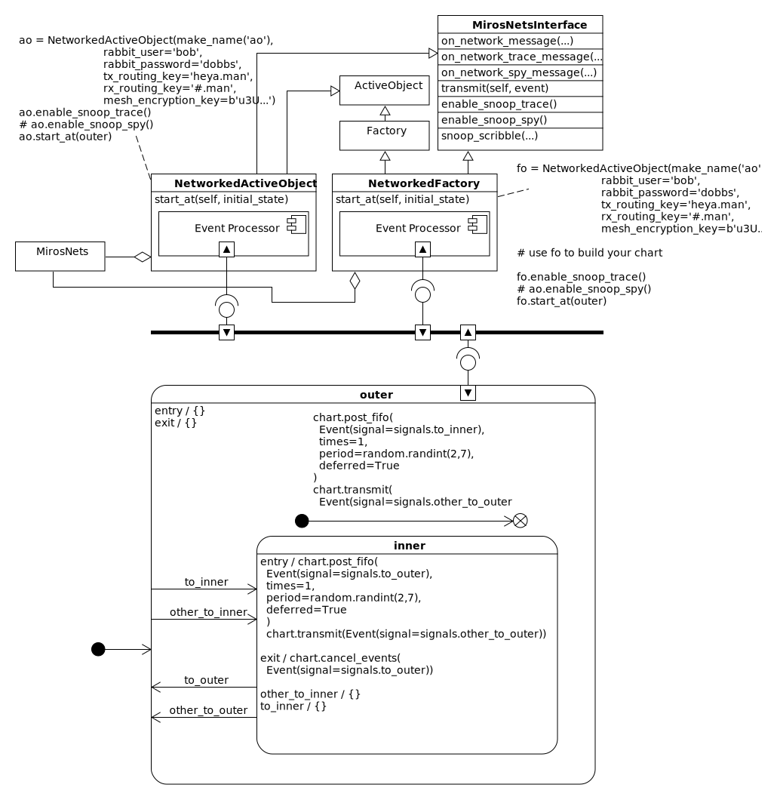

.. _example:

Example
========

.. epigraph::

  *You can analyse the past, but you need to design the future.  That is the
  difference between suffering the future and enjoying it.*

  -- Edward de Bono

.. toctree::
   :maxdepth: 1
   :caption: Single Chart Examples:

In this section I will show how to network some statecharts using the
miros-rabbitmq plugin.  Here is a diagram that throws all of this example’s
ideas at you at once:

The diagram above illustrates:

* How you can link a NetworkedActiveObject or a NetworkedFactory to a statechart.
* How these networked classes are just generalizations of the miros classes. 
* How they have a standard interface, so they can share the same networking API.
* That they both contain a MirosNets object that does the lion's share of the
  networking for them.

In this example, I’ll create two different objects which implement the
statechart in the diagram. One will use the NetworkedActiveObject class, and the
other will use the NetworkedFactory class.

The pictured statechart is a simple ergotic design that can work on its own or
with one or more statecharts just like it.  If there is more than one of these
statecharts working together, they can run on the same computer in different
processes or on different computers across a network.

The statechart can send events to itself and others.  To avoid any confusion
about where events are coming from we follow a simple coding convention: any
event that is alien to the statechart will have the word 'other' pre-pended
to it's signal name.

Before you begin the example :ref:`get your RabbitMQ installation
working<installing_infrastructure-installing-required-programs>` , then install
the miros and the miros-rabbitmq packages using pip.

The example will be broken down into three parts:

* :ref:`Build a NetworkedActiveObject with Details<example-networkedactiveobjectwithdetails>`
* :ref:`Build a NetworkedActiveObject<example-build-a-networkedactiveobject>`
* :ref:`Build a NetworkedFactory<example-networkedfactory>`

.. _example-networkedactiveobjectwithdetails:

Build a NetworkedActiveObject with Details
---------------------------------------------
This example will describe a few network details, and some of the mechanisms
under the hood.  If you would rather just look at an example without such
detail, look :ref:`here <example-build-a-networkedactiveobject>`.

To build the NetworkedActiveObject we import the required libraries:

.. code-block:: python

  import time
  import uuid # to generate a unique name
  import random
  from miros.hsm import spy_on
  from miros.event import signals, Event, return_status
  from miros_rabbitmq.network import NetworkedActiveObject

Then we construct a function that will generate a unique name for our
statechart:

.. code-block:: python

  def make_name(post):
    return str(uuid.uuid4())[0:5] + '_' + post

Now we consider the statechart part of our design:

.. image:: _static/miros_rabbitmq_example_1.svg
    :target: _static/miros_rabbitmq_example_1.pdf
    :align: center

.. code-block:: python
  :emphasize-lines: 7,22,50,52,71

  def outer_init(chart, e):
    chart.post_fifo(
      Event(signal=signals.to_inner),
      times=1,
      period=random.randint(2, 7),
      deferred=True)
    chart.transmit(Event(signal=signals.other_to_outer, payload=chart.name))
    return return_status.HANDLED

  def outer_to_inner(chart, e):
    return chart.trans(inner)

  def outer_other_to_inner(chart, e):
    return chart.trans(inner)

  def inner_entry(chart, e):
    chart.post_fifo(
      Event(signal=signals.to_outer),
      times=1,
      period=random.randint(2, 7),
      deferred=True)
    chart.transmit(Event(signal=signals.other_to_inner, payload=chart.name))
    return return_status.HANDLED

  def inner_exit(chart, e):
    chart.cancel_events(Event(signal=signals.to_outer))
    return return_status.HANDLED

  def inner_other_to_inner(chart, e):
    return return_status.HANDLED

  def inner_to_inner(chart, e):
    return return_status.HANDLED

  def inner_to_outer(chart, e):
    return chart.trans(outer)

  def inner_other_to_outer(chart, e):
    return chart.trans(outer)

  @spy_on
  def inner(chart, e):
    status = return_status.UNHANDLED
    if(e.signal == signals.ENTRY_SIGNAL):
      status = inner_entry(chart, e)
    elif(e.signal == signals.INIT_SIGNAL):
      status = return_status.HANDLED
    elif(e.signal == signals.to_outer):
      status = inner_to_outer(chart, e)
    elif(e.signal == signals.other_to_outer):
      status = inner_other_to_outer(chart, e)
    elif(e.signal == signals.other_to_inner):
      status = inner_other_to_inner(chart, e)
    elif(e.signal == signals.to_inner):
      status = inner_to_inner(chart, e)
    elif(e.signal == signals.EXIT_SIGNAL):
      status = inner_exit(chart, e)
    else:
      status, chart.temp.fun = return_status.SUPER, outer
    return status

  @spy_on
  def outer(chart, e):
    status = return_status.UNHANDLED
    if(e.signal == signals.ENTRY_SIGNAL):
      status = return_status.HANDLED
    elif(e.signal == signals.INIT_SIGNAL):
      status = outer_init(chart, e)
    elif(e.signal == signals.to_inner):
      status = outer_to_inner(chart, e)
    elif(e.signal == signals.other_to_inner):
      status = outer_other_to_inner(chart, e)
    elif(e.signal == signals.EXIT_SIGNAL):
      status = return_status.HANDLED
    else:
      status, chart.temp.fun = return_status.SUPER, chart.top
    return status

I have highlighted the `other` event signals in the code listing.  This is to
demonstrate how the statechart will react to such events when they have been
received from another statechart, and how to transmit them out to others.

The `other` event signals received from another statechart are placed in the
FIFO of the active object by the miros-rabbitmq library.  As far as the event
processor is concerned, they are no different than any native event; the only
way that we know they are alien is that we have pre-pended the word 'other' to
them, as a coding convention.

To send a message out to another statechart, you use the ``transmit`` api
provided by the NetworkedActiveObject.

.. note::

  Be careful where you place your transmit calls in your statecharts, since it is
  easy to create an event oscillation between your networked charts.  I tend to
  send out `other` events to the network when a state has been initialized, or
  entered (when in the inner most state).

.. image:: _static/miros_rabbitmq_example_2.svg
    :target: _static/miros_rabbitmq_example_2.pdf
    :align: center

.. note:: 
  Remember that ActiveObjects and thereby NetworkedActiveObjects are
  `polyamourous
  <https://aleph2c.github.io/miros/recipes.html#what-a-state-does-and-how-to-structure-it>`_.
  The same statechart structure can be used by many different
  NetworkedActiveObject's since they hold no state about themselves; they merely
  act as a blueprint of behavior.  All of the state information is held within the
  NetworkedActiveObject.

Now that we have a statechart we need to link it to a NetworkedActiveObject.
But before we do that, we need to build the NetworkedActiveObject using:

* the networking credentials we have set up for our RabbitMQ server
* a tx_routing key
* a rx_routing key
* the encryption keys that will be used by the other programs in our network.

.. code-block:: python

  ao = NetworkedActiveObject('make_name('ao'),
    rabbit_user='peter',
    rabbit_password='rabbit',
    tx_routing_key='heya.man',
    rx_routing_key='#.man',
    mesh_encryption_key=b'u3Uc-qAi9iiCv3fkBfRUAKrM1gH8w51-nVU8M8A73Jg=')

We name our ``ao`` object using the ``make_name`` function that we built at the top of the
example, it pre-pends 5 digits of a UUID to the front of ``_ao``.
The rabbit_user and rabbit_password, networking credentials are specified when you `install your RabbitMQ server
<installing_infrastructure-installing-required-programs>`_.  The topic
tx_routing_key are used by the RabbitMQ exchanges to publish to different
queues.  A consumer can subscribe to different topics `using a simple pattern
matching technique <https://www.rabbitmq.com/tutorials/tutorial-five-python.html>`_
specified with its rx_routing_key.  In our case our program will receive any
network message from exchanges with the last word of 'man' in their topic.

RabbitMQ supports SSL, but this library doesn't get involved in that.  If you
would like to install SSL, you can, and if it is working this library will
happily sit on top of it and not know that it is transmitting through a secure
connection.  This library does, however, have its own encryption layer for each
of its networks.  It uses symmetric encryption, so that the same key can be used to
encrypt and decrypt an object.

I am about to talk about some of the miros-rabbitmq package details, but you
don't need to know this stuff to make your example work.  So if you want to just
skip over this information and get back to the example click :ref:`here
<back_to_the_example>`.

Let's look at the networks that are turned on with the miros-rabbitmq library
(click to open it as a pdf):

.. image:: _static/miros_rabbitmq_network_1.svg
    :target: _static/miros_rabbitmq_network_1.pdf
    :align: center

The miros-rabbitmq package constructs the following:

* mesh network - used to transmit and receive messages between statecharts
* snoop_trace network - to debug your entire network using `trace
  <https://aleph2c.github.io/miros/recipes.html#using-the-trace>`_ instrumentation
* snoop_spy network - to debug the entire network using the `spy
  <https://aleph2c.github.io/miros/recipes.html#using-the-spy>`_

When you turn on your NetworkedActiveObject, it will scan your LAN looking for
other machines that have the same rabbit credentials that you are using, then it
will create a producer for each of them in each of the networks, so you don't
have to worry about feeding it IP addresses, it will find them if they are
connected in the same TCP/IP network.

Each of the networks can have their own encryption key, but if you only specify
the ``mesh_encryption_key`` in the NetworkedActiveObject constructor it will be
used by all of the networks.  The snoop_trace and snoop_spy encryption handles
for the NetworkedActiveObject constructor, are ``trace_snoop_encryption_key`` and
``spy_snoop_encryption_key``.

To build an encryption key for your distributed system:

.. code-block:: python

  from cryptography.fernet import Fernet
  new_encryption_key = Fernet.generate_key()

As an application developer you just need to know what goes in, and what comes
out of each of the miros-rabbitmq networks.  This will be talked about in the
next three paragraphs.  

The mesh network is fed an item using it's ``transmit`` method.  This
information will pop out on every connected machine with the same credentials,
posted into the fifo of another connected NetworkedActiveObject or
NetworkedFactory object as if that local machine posted that event to itself as
`post_fifo
<https://aleph2c.github.io/miros/recipes.html#posting-an-event-to-the-fifo>`_.

The snoop_trace network will consist of nodes that have turned on this trace
information using the ``enable_snoop_trace`` call.  If all of the nodes in your
distributed system have turned on their snoop_trace, the snoop_trace network
will have as many nodes as the mesh network.  Information is automatically fed
into the trace network, without any work required by the application developer.
When the snoop_trace is enabled, a NetworkedActiveObject or NetworkedFactory
will turn on it's `live trace feature
<https://aleph2c.github.io/miros/recipes.html#tracing-live>`_ and feed this
string into the snoop_trace network behind the scenes.  By default, the
enable_snoop_trace call will turn on an ``on_network_trace_message`` callback
which will color the messages using ANSI strings and print them to your screen.
If you need to log this information, use ``enable_snoop_trace_no_color`` to turn
on that node's participation in the snoop_trace network.

The snoop_spy network will output all of the spy information for all of the
nodes that have made an ``enable_snoop_spy`` call.  This amount of information
quickly becomes daunting unless you write this information into a log file then
filter it using grep.  If you are logging the information, you can use
``enable_snoop_spy_no_color`` and the ANSI color codes will not pollute your log
file.  After the snoop_spy network is enabled, the miros-rabbitmq package turns
on that node's `live spy feature
<https://aleph2c.github.io/miros/recipes.html#spying-live>`_.  All of the
snoop_spy information coming back from the network will be displayed to the
terminal.

.. _back_to_the_example:

Getting back to our example: so far, we have a state chart, we have a networked
active object and we know how to generate our own encryption key(s).  Now let's
turn on this statechart's contribution to the distributed system's
instrumentation, and link it to the network:

.. code-block:: python

  ao.enable_snoop_trace()  # we want to produce and receive trace information
  ao.enable_snoop_snoop()  # we want to produce and receive spy information
  ao.start_at(outer)  # networks turned on
  time.sleep(20)      # 60 seconds of statechart interactions

Let's run this program on it's own and see what it does:

.. raw:: html

  

  <iframe width="560" height="315" src="https://www.youtube.com/embed/nwyL9eTsBSU" frameborder="0" allow="autoplay; encrypted-media" allowfullscreen></iframe>
  

So the statechart is running there are no interactions with other statecharts
because we only see our own name, in blue, and no events with the word 'other'
prepended to their signal name:

.. code-block:: python

   [+s] 0ca32_ao START
   [+s] 0ca32_ao SEARCH_FOR_SUPER_SIGNAL:outer
   [+s] 0ca32_ao ENTRY_SIGNAL:outer
   [+s] 0ca32_ao INIT_SIGNAL:outer
   [+s] 0ca32_ao <- Queued:(0) Deferred:(0)
   [+t] [2018-05-04 08:02:36.593144] [0ca32_ao] e->start_at() top->outer
   [+t] [2018-05-04 08:02:40.594301] [0ca32_ao] e->to_inner() outer->inner
   [+s] 0ca32_ao to_inner:outer
   [+s] 0ca32_ao SEARCH_FOR_SUPER_SIGNAL:inner
   [+s] 0ca32_ao ENTRY_SIGNAL:inner
   [+s] 0ca32_ao INIT_SIGNAL:inner
   [+s] 0ca32_ao <- Queued:(0) Deferred:(0)
   [+s] 0ca32_ao to_outer:inner
   [+t] [2018-05-04 08:02:47.598616] [0ca32_ao] e->to_outer() inner->outer
   [+s] 0ca32_ao SEARCH_FOR_SUPER_SIGNAL:outer
   [+s] 0ca32_ao SEARCH_FOR_SUPER_SIGNAL:inner
   [+s] 0ca32_ao EXIT_SIGNAL:inner
   [+s] 0ca32_ao INIT_SIGNAL:outer
   [+s] 0ca32_ao <- Queued:(0) Deferred:(0)
   [+s] 0ca32_ao to_inner:outer
   [+s] 0ca32_ao SEARCH_FOR_SUPER_SIGNAL:inner
   [+t] [2018-05-04 08:02:51.601238] [0ca32_ao] e->to_inner() outer->inner
   [+s] 0ca32_ao ENTRY_SIGNAL:inner
   [+s] 0ca32_ao INIT_SIGNAL:inner
   [+s] 0ca32_ao <- Queued:(0) Deferred:(0)
   [+t] [2018-05-04 08:02:53.603454] [0ca32_ao] e->to_outer() inner->outer
   [+s] 0ca32_ao to_outer:inner
   [+s] 0ca32_ao SEARCH_FOR_SUPER_SIGNAL:outer
   [+s] 0ca32_ao SEARCH_FOR_SUPER_SIGNAL:inner
   [+s] 0ca32_ao EXIT_SIGNAL:inner
   [+s] 0ca32_ao INIT_SIGNAL:outer
   [+s] 0ca32_ao <- Queued:(0) Deferred:(0)

Now let's turn on two of these statecharts with in the same machine.  I'll do
this using TMUX, running in the WLS:

.. raw:: html

  

  <iframe width="560" height="315" src="https://www.youtube.com/embed/U_F5icOP87w" frameborder="0" allow="autoplay; encrypted-media" allowfullscreen></iframe>
  

The blue highlighted names are different in each of the launch instances.  The
blue represents the name of that instance and the purple is the name or names of
any other node that is interacting with the instance.

We see that even with two simple statecharts, the snoop_spy network is spamming
us with way too much information, so let's turn it off.

.. code-block:: python
  :emphasize-lines: 2

  ao.enable_snoop_trace()    # we want to produce and receive trace information
  # ao.enable_snoop_snoop()  # turn off the snoop_spy network
  ao.start_at(outer)  # networks turned on
  time.sleep(20)      # 60 seconds of statechart interactions

.. raw:: html

  

  <iframe width="560" height="315" src="https://www.youtube.com/embed/U_F5icOP87w" frameborder="0" allow="autoplay; encrypted-media" allowfullscreen></iframe>
  

Now I'll log into another computer in the same network.  I'll run one instance
of the program on that computer and one program locally:

.. raw:: html

  

  <iframe width="560" height="315" src="https://www.youtube.com/embed/MI8Sym3rCO0" frameborder="0" allow="autoplay; encrypted-media" allowfullscreen></iframe>
  

We see that there is a delay, then the programs begin to run.  

It is the network discovery process that causes the delay.  When either one of
these programs turns on, they look at their computers network attributes and
determine what it's network broadcast address is.  They then ping this broadcast
address in the hopes that other computers on the LAN will respond.  This
response will fill the machine's ARP table.  The program then uses all of the
addresses in this ARP table to build a list of candidate AMPQ_URLS that it can
feed to its local RabbitMQ server.  It sends out a request to each of the
addresses on the list and removes any address that times out.  The remaining
addresses are used by the distributed system as peers.

Now to quickly document our trace; we could turn it into a sequence diagram.
With the sequence diagram and the statechart we can quickly describe the
dynamics of our distributed system.  Consider the trace from running this
program:

.. code-block:: python

  [+t] [2018-05-04 09:23:29.177773] [04ccc_ao] e->start_at() top->outer
  [+t] [2018-05-04 09:23:28.954560] [2771f_ao] e->start_at() top->outer
  [+t] [2018-05-04 09:23:34.178157] [04ccc_ao] e->to_inner() outer->inner
  [+t] [2018-05-04 09:23:34.256485] [2771f_ao] e->other_to_inner() outer->inner
  [+t] [2018-05-04 09:23:37.178813] [04ccc_ao] e->to_outer() inner->outer
  [+t] [2018-05-04 09:23:37.182660] [2771f_ao] e->other_to_outer() inner->outer
  [+t] [2018-05-04 09:23:39.180004] [04ccc_ao] e->to_inner() outer->inner
  [+t] [2018-05-04 09:23:39.191635] [2771f_ao] e->to_inner() outer->inner
  [+t] [2018-05-04 09:23:44.181613] [04ccc_ao] e->to_outer() inner->outer
  [+t] [2018-05-04 09:23:44.257442] [2771f_ao] e->other_to_outer() inner->outer
  [+t] [2018-05-04 09:23:49.183205] [04ccc_ao] e->to_inner() outer->inner
  [+t] [2018-05-04 09:23:49.233582] [2771f_ao] e->other_to_inner() outer->inner

In the following video I feed the trace into the sequence tool:

.. raw:: html

  

  <iframe width="560" height="315" src="https://www.youtube.com/embed/GQRh5Bd91O8" frameborder="0" allow="autoplay; encrypted-media" allowfullscreen></iframe>
  

You can see that I spent a of of time writing numbers into the diagram.  This is
because the sequence tool has no way to understand your trace; you understand
your system better than it does, so you need write in the numbers to describe
when things happen, or if they happen together.

The result is something like this:

.. code-block:: python

  [Statechart: 04ccc_ao] (A)
        top           outer          inner
         +--start_at()->|              |
         |     (1)      |              |
         |              +--to_inner()->|
         |              |     (3)      |
         |              +<-to_outer()--|
         |              |     (5)      |
         |              +--to_inner()->|
         |              |     (7)      |
         |              +<-to_outer()--|
         |              |     (9)      |
         |              +--to_inner()->|
         |              |     (11)     |

  [Statechart: 2771f_ao] (B)
           top                 outer                inner
            +-----start_at()---->|                    |
            |        (2)         |                    |
            |                    +--other_to_inner()->|
            |                    |        (4)         |
            |                    +<-other_to_outer()--|
            |                    |        (6)         |
            |                    +-----to_inner()---->|
            |                    |        (8)         |
            |                    +<-other_to_outer()--|
            |                    |        (10)        |
            |                    +--other_to_inner()->|
            |                    |        (11)        |

The sequence tool quickly pulls out each statechart's contribution to
snoop_trace, attributing them to their own sequence diagram.  This is useful if
you are describing some complicated multi-unit feature in your design.

.. _example-build-a-networkedactiveobject:

Build a NetworkedActiveObject
-----------------------------
Here I'll make another version of the NetworkedActiveObject code without a lot
of extra explanation.

Starting with a picture of the statechart what we want to build:

.. image:: _static/miros_rabbitmq_example_1.svg
    :target: _static/miros_rabbitmq_example_1.pdf
    :align: center

We import the required items:

.. code-block:: python

  import time
  import uuid # to generate a unique name
  import random
  from miros.hsm import spy_on
  from miros.event import signals, Event, return_status
  from miros_rabbitmq.network import NetworkedActiveObject

Then we construct a function that will generate a unique name for our
statechart:

.. code-block:: python

  def make_name(post):
    return str(uuid.uuid4())[0:5] + '_' + post

We write the statechart using the flat method required by the ActiveObject.

.. code-block:: python

  def outer_init(chart, e):
    chart.post_fifo(
      Event(signal=signals.to_inner),
      times=1,
      period=random.randint(2, 7),
      deferred=True)
    chart.transmit(Event(signal=signals.other_to_outer, payload=chart.name))
    return return_status.HANDLED

  def outer_to_inner(chart, e):
    return chart.trans(inner)

  def outer_other_to_inner(chart, e):
    return chart.trans(inner)

  def inner_entry(chart, e):
    chart.post_fifo(
      Event(signal=signals.to_outer),
      times=1,
      period=random.randint(2, 7),
      deferred=True)
    chart.transmit(Event(signal=signals.other_to_inner, payload=chart.name))
    return return_status.HANDLED

  def inner_exit(chart, e):
    chart.cancel_events(Event(signal=signals.to_outer))
    return return_status.HANDLED

  def inner_other_to_inner(chart, e):
    return return_status.HANDLED

  def inner_to_inner(chart, e):
    return return_status.HANDLED

  def inner_to_outer(chart, e):
    return chart.trans(outer)

  def inner_other_to_outer(chart, e):
    return chart.trans(outer)

  @spy_on
  def inner(chart, e):
    status = return_status.UNHANDLED
    if(e.signal == signals.ENTRY_SIGNAL):
      status = inner_entry(chart, e)
    elif(e.signal == signals.INIT_SIGNAL):
      status = return_status.HANDLED
    elif(e.signal == signals.to_outer):
      status = inner_to_outer(chart, e)
    elif(e.signal == signals.other_to_outer):
      status = inner_other_to_outer(chart, e)
    elif(e.signal == signals.other_to_inner):
      status = inner_other_to_inner(chart, e)
    elif(e.signal == signals.to_inner):
      status = inner_to_inner(chart, e)
    elif(e.signal == signals.EXIT_SIGNAL):
      status = inner_exit(chart, e)
    else:
      status, chart.temp.fun = return_status.SUPER, outer
    return status

  @spy_on
  def outer(chart, e):
    status = return_status.UNHANDLED
    if(e.signal == signals.ENTRY_SIGNAL):
      status = return_status.HANDLED
    elif(e.signal == signals.INIT_SIGNAL):
      status = outer_init(chart, e)
    elif(e.signal == signals.to_inner):
      status = outer_to_inner(chart, e)
    elif(e.signal == signals.other_to_inner):
      status = outer_other_to_inner(chart, e)
    elif(e.signal == signals.EXIT_SIGNAL):
      status = return_status.HANDLED
    else:
      status, chart.temp.fun = return_status.SUPER, chart.top
    return status

We would up a NetworkedActiveObject; providing the required network credentials
and topic keys.

.. code-block:: python

  ao = NetworkedActiveObject('make_name('ao'),
    rabbit_user='peter',
    rabbit_password='rabbit',
    tx_routing_key='heya.man',
    rx_routing_key='#.man',
    mesh_encryption_key=b'u3Uc-qAi9iiCv3fkBfRUAKrM1gH8w51-nVU8M8A73Jg=')

We enable the level of instrumentation we want (trace) and start the chart and
let it run for 20 seconds:

.. code-block:: python

  ao.enable_snoop_trace()  # we want to produce and receive trace information
  ao.start_at(outer)  # networks turned on
  time.sleep(20)      # 60 seconds of statechart interactions
.. _example-networkedfactory:

Building a NetworkedFactory
---------------------------
Let's build the same chart using an NetworkedFactory:

.. image:: _static/miros_rabbitmq_example_1.svg
    :target: _static/miros_rabbitmq_example_1.pdf
    :align: center

We import what is needed:

.. code-block:: python

  import time
  import uuid
  import random
  from miros_rabbitmq.network import NetworkedFactory
  from miros.event import signals, Event, return_status

Then we write something that will make a unique name for each of our networked
state machines:

.. code-block:: python

  def make_name(post):
    return str(uuid.uuid4())[0:5] + '_' + post

Studying our diagram we generate the required callback methods for our factory:

.. code-block:: python
  
  def on_outer_init(chart, e):
    chart.post_fifo(Event(signal=signals.to_inner),
      times=1,
      period=random.randint(2, 7),
      deferred=True)
    chart.transmit(Event(signal=signals.other_to_outer))
    return return_status.HANDLED

  def on_outer_to_inner(chart, e):
    return chart.trans(inner)

  def on_outer_other_to_inner(chart, e):
    return chart.trans(inner)

  def on_inner_entry(chart, e):
    chart.post_fifo(Event(signal=signals.to_outer),
      times=1,
      period=random.randint(2, 7))
    chart.transmit(Event(signal=signals.other_to_inner))
    return return_status.HANDLED

  def on_inner_exit(chart, e):
    chart.cancel_events(
      Event(signal=signals.to_outer))
    return return_status.HANDLED

  def on_inner_other_to_inner(chart, e):
    return return_status.HANDLED

  def on_inner_to_inner(chart, e):
    return return_status.HANDLED

  def on_inner_to_outer(chart, e):
    return chart.trans(outer)

  def on_inner_other_to_outer(chart, e):
    return chart.trans(outer)

We build a NetworkedFactory object with the required networking credentials, the
routing keys we want and an encryption key:

.. code-block:: python

    chart = NetworkedFactory(make_name('fo'),
             rabbit_user='bob',
             rabbit_password='dobbs',
             tx_routing_key='heya.man',
             rx_routing_key='#.man',
             mesh_encryption_key=b'u3Uc-qAi9iiCv3fkBfRUAKrM1gH8w51-nVU8M8A73Jg=')

Now we use the factory to build up states:

.. code-block:: python

  outer = chart.create(state='outer'). \
            catch(signal=signals.to_inner, handler=on_outer_to_inner). \
            catch(signal=signals.other_to_inner, handler=on_outer_other_to_inner). \
            catch(signal=signals.INIT_SIGNAL, handler=on_outer_init). \
            to_method()

  inner = chart.create(state='inner'). \
            catch(signal=signals.ENTRY_SIGNAL, handler=on_inner_entry). \
            catch(signal=signals.EXIT_SIGNAL, handler=on_inner_exit). \
            catch(signal=signals.other_to_inner, handler=on_inner_other_to_inner). \
            catch(signal=signals.to_inner, handler=on_inner_to_inner). \
            catch(signal=signals.to_outer, handler=on_inner_to_outer). \
            catch(signal=signals.other_to_outer, handler=on_inner_other_to_outer). \
            to_method()

Add the hierarchy:

.. code-block:: python

  chart.nest(outer, parent=None). \
        nest(inner, parent=outer)

The we seed our random number generator, enable the instrumentation we want and
start the statechart and let it run for 20 seconds:

.. code-block:: python

  random.seed()
  chart.enable_snoop_trace()
  chart.start_at(outer)
  time.sleep(20)

:ref:`prev <how_it_works-how-the-plugin-works>`, :ref:`top <top>`, :ref:`next <recipes-recipes>`
