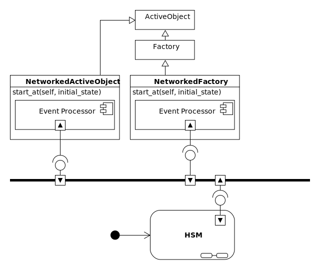
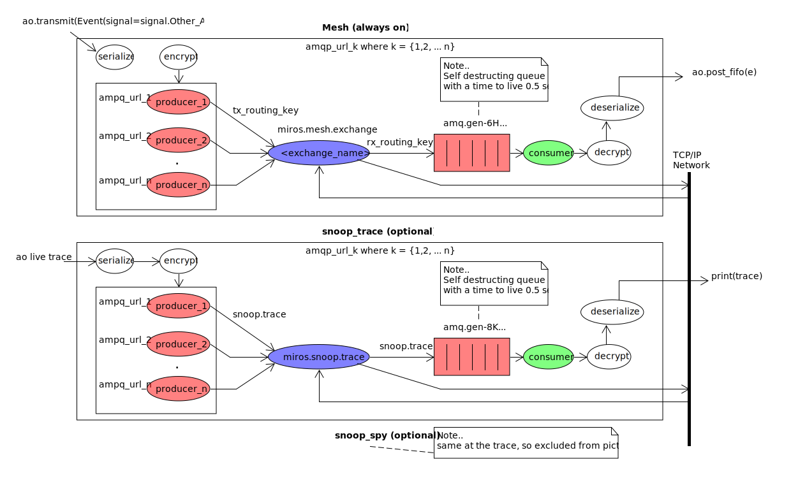
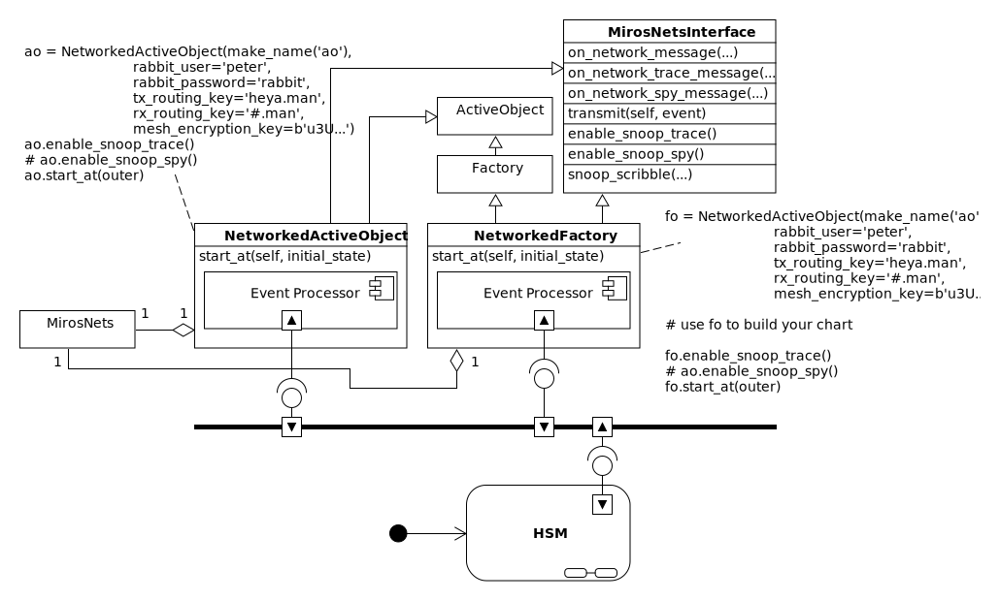
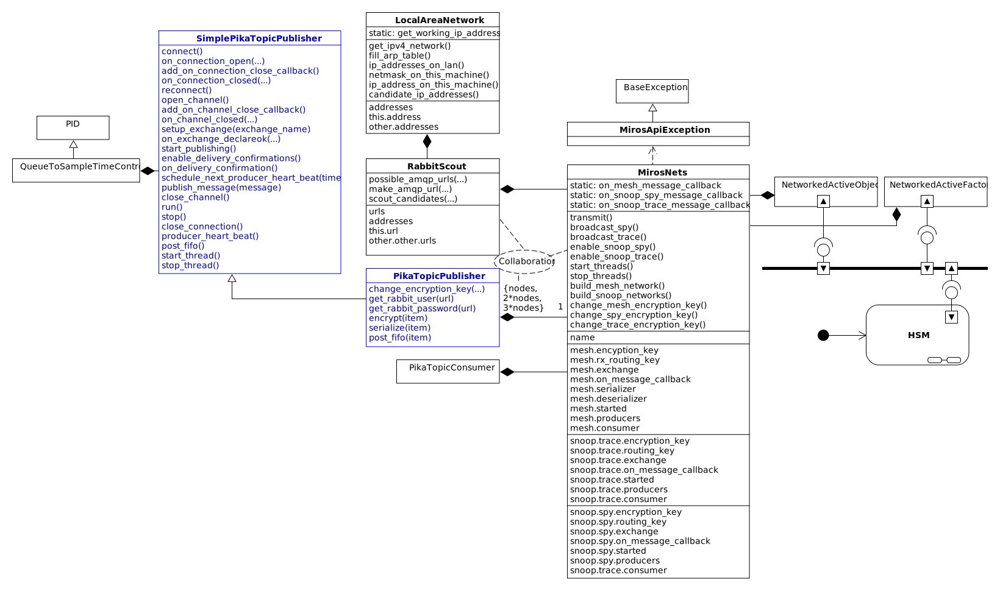
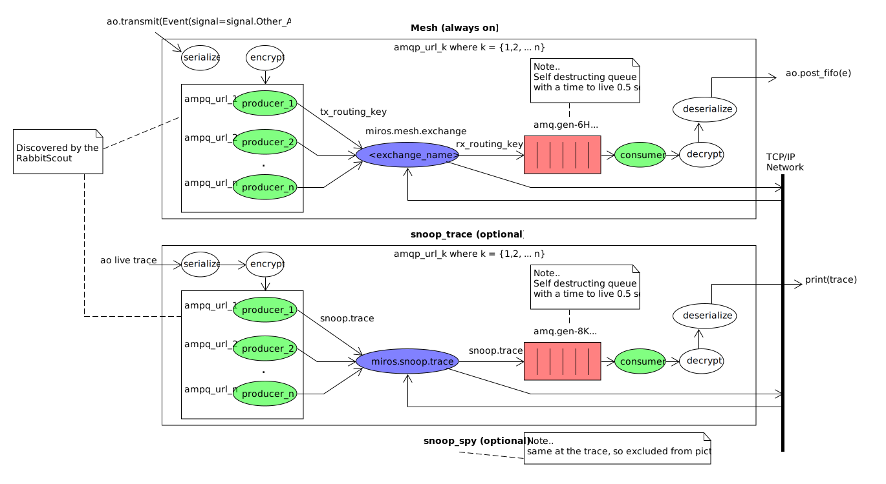
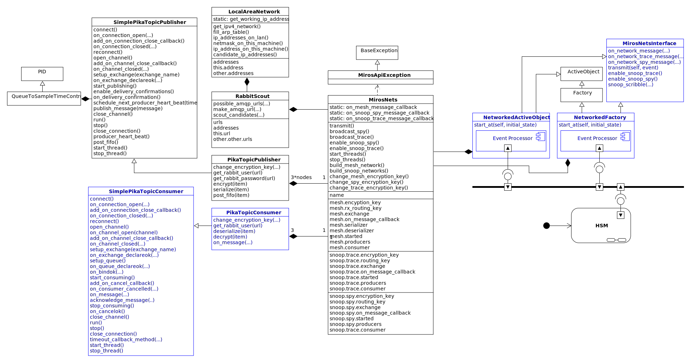

.. _how_it_works-how-the-plugin-works: 

How it Works
============

.. epigraph::

  *The most contrarian thing of all is not to oppose the crowd but to think for
  yourself.*

  -- Peter Thiel

.. note:: 

  You don't need to understand this page to use this library.  It has been added
  to round out the documentation and to be a guide for writing other network
  plugins for miros.  If a diagram is too small, click on it to see it's pdf.
  If you don't have a lot of time, your time would be better spent looking at
  the :ref:`next example <example>`.

There are two main classes that you will use with miros to build statecharts,
the `ActiveObject <https://aleph2c.github.io/miros/singlechartexample.html>`_ and
the `Factory <https://aleph2c.github.io/miros/towardsthefactoryexample.html#towardsthefactoryexample-using-the-factory-class>`_
class.  This plugin extends these two classes as the NetworkedActiveObject and
the NetworkedFactory class.

To build a state chart you would follow all of the same `rules that you learned
before <https://aleph2c.github.io/miros/recipes.html>`_ and you would get some
additional networking features.

So, if you wanted to have networked statecharts you would install miros,
miros-rabbitmq and RabbitMQ.  If you wanted to build your statechart using flat
methods you would use the NetworkedActiveObject class.  If you would rather
build it up using callbacks you would use the NetworkedFactory class.

Both of these networked classes share the same interface and communicate on the
same infrastructure:  the miros-rabbitmq plugin builds up three topic based AMPQ
networks named the mesh, the snoop_trace and the snoop_spy.

The mesh network is used by the statecharts to send encrypted and serialized
events to one another.  The snoop_trace is used to share trace instrumentation
output between all of the connected computers.  It provides the means to debug
your entire distributed system from one location.  The snoop_spy is like the
snoop_trace, but it shares the spy information (a lot of information) between
all of your connected computers.  Each network can be configured with it's own
encryption key.  The snoop_trace and snoop_spy networks can be enabled and
disabled independently, but the mesh is always on.

This plugin's main methods are the ``transmit``, ``enable_snoop_trace``, and
``enable_snoop_spy``.  The NetworkedActiveObject and the NetworkedFactory share
the same interface.

.. image:: _static/miros_rabbitmq_1.svg
    :target: _static/miros_rabbitmq_1.pdf
    :align: center

The ``transmit`` is used to send out an event to the mesh network.  When it is
received by another statechart, it's event is place in it's FIFO queue for
processing.   The statechart receiving such an event, has no notion that the
event came from another machine.  If it has been designed to respond to the
event it will.

The NetworkedActiveObject and NetworkedFactory require more information in their
constructors than do the ActiveObject and the Factory.  This information
describes the credentials required to connect to the RabbitMQ server and the
encryption key(s) for the three different networks.

.. image:: _static/miros_rabbitmq_2.svg
    :target: _static/miros_rabbitmq_2.pdf
    :align: center

The snoop_trace and snoop_spy networks will use the ``mesh_encryption_key`` if a
``trace_snoop_encryption_key`` or a ``spy_snoop_encryption_key`` are not
provided.

The NetworkedActiveObject and NetworkedFactory have a MirosNets object.

.. image:: _static/miros_rabbitmq_3.svg
    :target: _static/miros_rabbitmq_3.pdf
    :align: center

The MirosNets object is the thing that actually builds up the mesh, the snoop_trace and
the snoop_spy networks.  It also provides the means to specify a custom
serializer and de-serializer function.  If custom serialization routines are
not specified it will use pickle version 3.  A MirosNets object can be programmed with
custom callback functions that are triggered when messages are received on any
of the three networks.

.. note::

  It doesn't take long before UML class diagrams turn into a poem written for the
  poet himself, a work that no one else understands or wants to endure.  My
  pictures are about to reach this level of conceit; their utility
  diminishes with the addition of more detail.  If you're going to follow the
  design I recommend using whatever code navigation tool you have installed.
  I'll colour the parts of the diagram so you know what the docs are referencing
  in the picture.

The MirosNets class, uses a RabbitScout object to find other machines on the
network.  The RabbitScout builds up a LocalAreaNetwork object which finds all of
the IP addresses on the LAN by pinging the broadcast address, and filling the
ARP table of the machine it is running on.  It uses this ARP table to find a
short list of available IP addresses.  The RabbitScout then initiates contact to
these IP addresses and if a time out doesn't occur, it assumes AMQP connections
are possible. It uses the working IP addresses to build up a custom AMPQ_URL and
assigns it to it's urls attribute.

The MirosNets uses the AMPQ_URL addresses provided by the RabbitScout to build
it's producers.  

There is one producer per network for every working AMPQ_URL
provided by the RabbitScout.  To build up a producer MirosNets uses the
PikaTopicPublisher object which wraps the SimplePikaTopicPublisher with
encryption and serialization methods.

The SimplePikaTopicPublisher is the thing that actually performs the network
publishing function of this library.  It is heavily based upon the `asynchronous
pika publisher example
<http://pika.readthedocs.io/en/0.11.2/examples/asynchronous_publisher_example.html>`_
provided in the pika library documentation.

Before using this example as a base for the publishing feature I used the
example provided on the RabbitMQ page.  The code based on these examples would
run for about 15 minutes prior to failing.  I gave up trying to troubleshoot the
issue because of the slow feedback time between failures.  Since re-writing
everything based on the much more complicated `asynchronous pika publisher
example
<http://pika.readthedocs.io/en/0.11.2/examples/asynchronous_publisher_example.html>`_
the connections have been stable.  

.. note::

  The pika example was very mysterious about how it was actually
  suppose to be used.  There are a lot of questions about it on stackover flow;
  more open secrets abound in this community.

The SimplePikaTopicPublisher class is different than the pika asynchronous
publisher example provided in their documentation, in that it has a thread who's
sole purpose is to wrap the ``run`` method provided by their example.  The ``run``
method runs forever, and no code below it in the file will ever have access to
the CPU.  So, by wrapping the ``run`` method in a thread, it can do its thing
without destroying the program flow.  This ``run`` method provides an event loop
in which pika can send out messages to the network using callbacks, the most
important of which is the ``producer_heart_beat``.  When this ``producer_heart_beat``
callback is called, it checks a queue to see if anyone in another thread wants to
send something.  If so, it creates a partial function from the
``publish_message`` callback using the message provided by the queue.  It then
schedules the new wrapped ``publish_message`` to be called immediately by the
pika event loop.  After clearing the queue in this way, it schedules itself with
the pika event loop so that it will be rerun sometime in the future.  I added
some code to control this time-out duration.  If there are a lot of messages in
the queue, the ``producer_heart_beat`` will occur quicker than it did before, if
there are no items in the queue it will relax its time-out duration to it's
slowest default tempo.  This tempo-time-control feature was made using a
PID controller.

The MiroNets only has one consumer per network.  The consumer's responsiblity is
to respond to messages coming from the RabbitMQ service, to decrypt,
de-serialize them then to dispatch them out to whatever needs to know about this
information.  In the case of the Mesh network, a message is dispatched into the
statechart's FIFO.  In the case of the snoop trace and snoop spy networks, the
messages are formatted with colour and output to the terminal.

The PikaTopicConsumer provides the decryption and deserialization for each
network consumer.  

PikaTopicConsumer is a subclass of SimplePikaTopicConsumer, which is heavily
based upon the `asynchronous pika consumer example.
<http://pika.readthedocs.io/en/0.11.2/examples/asynchronous_consumer_example.html>`_

The PikaTopicConsumer class is different from the `asynchronous pika consumer
example.
<http://pika.readthedocs.io/en/0.11.2/examples/asynchronous_consumer_example.html>`_
in that it wraps the ``run`` method in a thread (as in the producer). The
``run`` method starts a pika event loop.  A
``timeout_callback_method`` runs within pika producer's event loop.  It checks to see if
another thread wants to stop the consumer, if so, it kills the pika event loop,
if not, it registers itself as a callback sometime in the future.

The ``on_message`` of PikaTopicConsumer class is never called because it is
overloaded by the PikaTopicConsumer.  The ``on_message`` method of the
PikaTopicConsumer decrypts and deserializes any message received by RabbitMq.
It takes the result and passes it onto the
``message_callback`` that was registerd with the class.  This
``message_callback`` is provided in it's constructor.  It is the MirosNets class
which constructs 3 (one per network) of these objects and its ``on_message``
callback functions are provided by the NetworkedActiveObject and
NetworkedFactory.  The common ``on_message`` behavior of the
NetworkedActiveObject and NetworkedFactory are provided by the
MirosNetsInterface.

:ref:`prev <quick_start-quick-start>`, :ref:`top <top>`, :ref:`next <example>`
