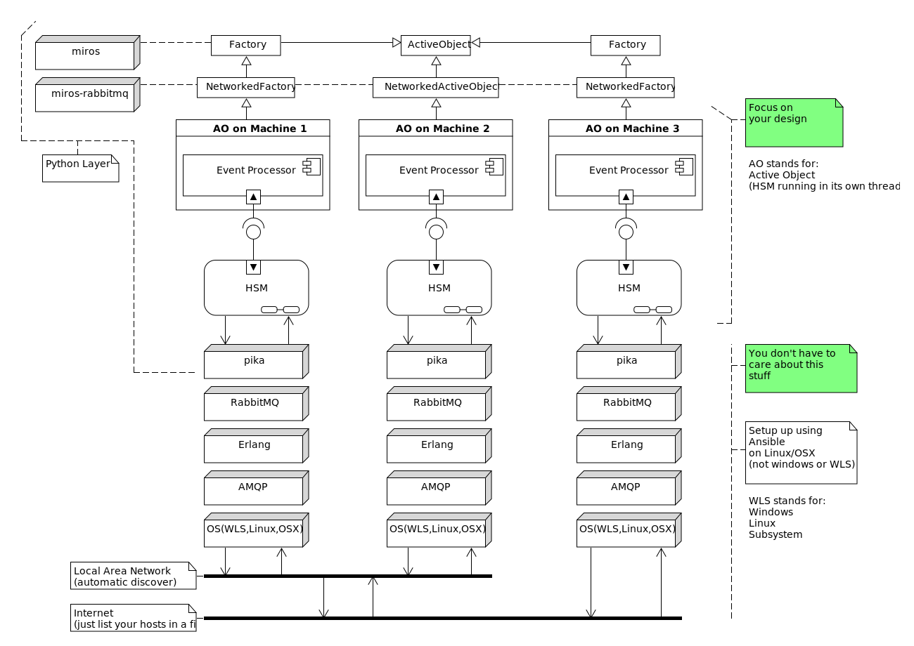

.. _introduction-introduction:

Introduction
============

.. epigraph::

  *The destiny of computers is to become interactive intellectual amplifiers for
  all humans, pervasively networked world-wide.*

  -- Joseph Carl Robnett Licklider

The miros-rabbitmq lets you network your `miros
<https://aleph2c.github.io/miros/index.html>`_ statecharts.  It provides
encrypted channels of communication over which you can send Python objects.  The
miros-rabbitmq package tries very hard to hide a lot of the network complexity
from you, so you can put all of your efforts toward your design instead.

By networking statecharts you can build distributed systems, IOT frameworks or
Botnets.

To use the library:

* :ref:`Install RabbitMQ <installing_infrastructure-installing-required-programs>`
* :ref:`Install miros-rabbitmq<installation-installation>`
* Replace your `miros ActiveObject <https://aleph2c.github.io/miros/singlechartexample.html>`_ class with a :ref:`miros-rabbitmq NetworkedActiveObject <example-networkedactiveobjectwithdetails>` class.
* Replace your `miros Factory <https://aleph2c.github.io/miros/recipes.html#creating-a-statechart-from-a-factory>`_ class with a :ref:`miros-rabbitmq NetworkedFactory<example-networkedfactory>` class.
* To transmit events between networked statecharts use the :ref:`transmit<recipes-transmitting-an-event>` method.
* Debug/document your networked software using the :ref:`snoop_trace<recipes-snoop-trace>` and the :ref:`snoop_spy <recipes-snoop-spy>`.
* Once you are happy with your software, you can build a :ref:`deployment procedure <deployment-deployment>` so that you can install the required infrastructure, credentials and secrets on many different machines.

This document was intended to guide someone who already understands how to use
the miros statechart Python package.  If you don't know anything about this, get a
decent handle on the  `miros software <https://aleph2c.github.io/miros/html/index.html>`_ first,
then come back and learn how to network it.

.. note::

  If any of the documents are too small in your browser, click on them and you
  will see a full sized pdf version of the same image.

RabbitMQ is an open source networking library written in Erlang which supports
the AMQP messaging protocol.  `Pika <https://pika.readthedocs.io/en/0.11.2/>`_ is a Python package that interfaces Python
code with `RabbitMQ <https://www.rabbitmq.com/>`_.  This miros-rabbitmq package uses pika to tie together miros
statecharts across the network using `AMQP <https://en.wikipedia.org/wiki/Advanced_Message_Queuing_Protocol>`_.

You can see how everything fits together in the following architectural diagram:

The event processor and statechart features are provided by the miros package.
The miros-rabbitmq package provides extensions to the Factory and ActiveObject
classes, NetworkedFactory and NetworkedActiveObject.  Your designs would inherit
from these classes.  The miros-rabbitmq package provides networking using pika
which in turn relies on the RabbitMQ server installed on each computer.
RabbitMQ is dependent upon the Erlang programming language and the AMQP
messaging protocol, both of which are dependent upon your underlying operating
system.

As mentioned miros-rabbitmq tries to remove a lot of the complexity of
networking away from the statechart developer.  Unfortunately, installing
RabbitMQ is not trivial, and their documents are written as a collection of open
secrets.

So, this guide, in addition to talking about miros-rabbitmq, will talk about
:ref:`installing <installing_infrastructure-installing-required-programs>` the
required infrastructure on both :ref:`Linux
<installing_infrastructure-installing-on-linux>` (using automation) and
:ref:`Windows <installing_infrastructure-installing-on-windows>`.

.. toctree::
   :maxdepth: 2
   :caption: Contents:

